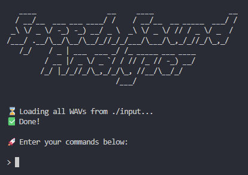
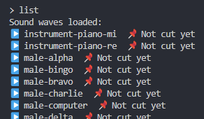
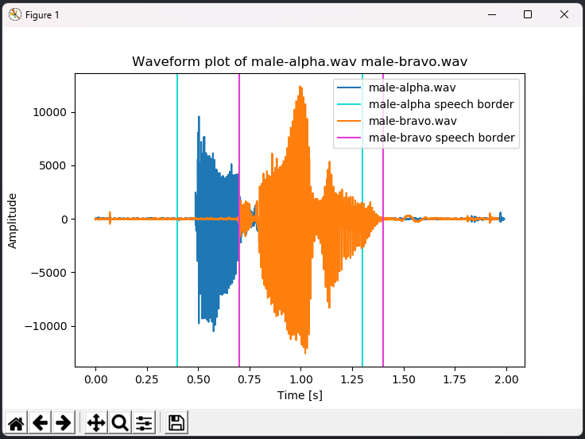
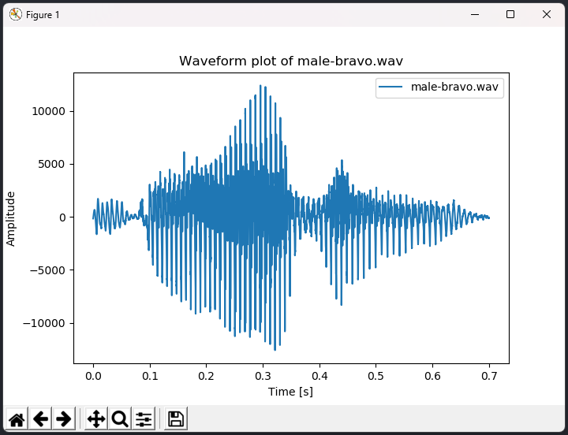
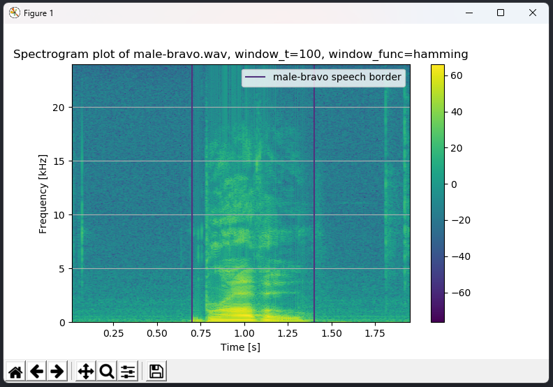
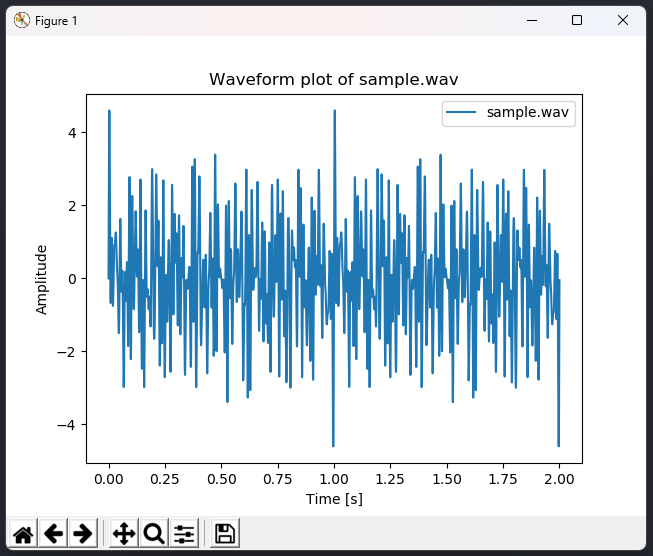

# Python Sound Wave Analysis

This program processes any given `.wav` signal to remove silence at the beginning/end of the record, and attempts to identify speech inside the wave. The wave(s) are then plotted as histograms, spectograms, etc. One or multiple waves may be plotted for comparison.

## Author

[](https://github.com/andrejanesic)

## Setup & Running

This is a command-line Python program. Python 3 is necessary to run. It is also possible to run this program via the given Dockerfile (through Makefile), however, you'll need to modify the Makefile to include a display port for Docker in order to see Pyplot graphs. It's recommended to run this program directly on your computer without Docker.

### Setup On Local Computer

To run this program on your local computer, execute the following Git command:

```
git clone https://github.com/andrejanesic/Python-Sound-Wave-Analysis.git
```

This will clone the repository onto your local computer.

This program requires Python, so if it isn't installed on your computer, you can download it from the [Python.org website.](https://www.python.org/downloads/)

Next, install the required libraries for Python using pip:

```
pip install wave numpy matplotlib scipy
```

You're good to go!

## Task Specification

This program was developed as an individual assignment for the class of [[5025] Speech Recognition](https://raf.edu.rs/en/component/content/article/192-english/subjects/3359-speech-recognition), cohort 2022/23, at the [School of Computing, Union University, Belgrade.](https://rs.linkedin.com/school/racunarski-fakultet/)

### Task Description

Develop a tool for plotting the frequency spectrum of recordings of words. Usage of an existing DFT algorithm is allowed.

### Input

The input consists of 5 sound wave files. The files must be raw/unedited `.wav` files.

Each record must contain a single spoken word. There may be silence of arbitrary duration before and after the spoken word. The silent parts of the record must be programatically cut out before processing the sound.

Following the removal of silence, the sound wave should be algorithmically processed.

The program should allow for such selection and processing of **two** sound signals, in order to allow for comparison plotting.

### Notice

The system should display an error message in case no speech is recognized.

### Output

The program should display the waves' frequency spectrum in 4 different ways:

1. Plot the entire signal from the chosen `.wav` file, with timestamps of the beginning and end of the speech marked on the plot. The horizontal axis must be time, with the vertical axis being the values of the sound wave. The timestamps at the beginning and the end of the line should be visibly marked with two vertical red lines. In case no speech is recognized, those lines should be omitted.
2. Plot the entire signal from two sound waves, as described in point 1. The speech timestamp indicators should have distinct colors for each file.
3. Plot the frequency spectre for a selected time window in the form of a histogram. The horizontal axis should plot the frequency, with the vertical axis depicting the magnitude. Frequency should be displayed in `Hz` and the magnitude should be scaled to the range of `0-100`.
4. Plot the frequency spectre of two sound waves in the form of a spectrogram. The diagram should display time along the horizontal axis, frequency along the vertical axis, with the points representing the value of the magnitude. Both axis must be labelled, with a fixed number of equally distributed helper gridlines. The beginning and ending timestamps of spoken words should be clearly depicted as in point 1. Display a legend of the colors representing the magnitude.

### Parameters

The program should be parametarized by:

1. One or two `.wav` files for analysis chosen by the user.
2. User selection of window function (Hamming, Hanning or none.)
3. DFT window size.
4. Selection of frequency spectrum plot type and selection of sound wave to be plotted (or both in case of Output points 2 and 4.)

## How To Use

Run the program by executing the following command in your terminal:

```
python main.py
```



### Loading Sound Waves

In order to analyze a sound wave, you'll need to load it.

The program will automatically load all sound waves in the `.wav` file format from the `input` folder.

In order to load your own sound waves, copy the file you want to load into the program in the `input` folder, then enter:

```
> load <filename>
```

You may omit the ".wav" extension from the file name. _(All files from `input` will be automatically loaded on program start, so you don't need to load those again.)_

In order to see which sound waves are loaded, type:

```
> list
```

You'll see a list of all sound waves you can work with, and you'll receive an information whether they've been cleaned from noise or not.



### Analysis/Plotting Waves

Next, you can plot one or more sound waves with a simple amplitude-time graph by entering the following command:

```
> plot male-alpha male-bravo
```



The plot will include vertical axes at the beginning and end of detected speech for all specified sound waves.

_**NOTE:** omitting the names of sound waves to plot will plot **all** loaded sound waves, which could take a while!_

#### Cleaning From Noise

Next, you may wish to clean the non-speech parts (noise) from a given sound wave. To do so, run:

```
> cut male-bravo
```

Let's `male-bravo` sound wave to see its waveform now:



Noise has been removed from the signal.

We can now plot a signal as a histogram or spectrogram. To do that, specify the plot type with the `-t <waveform|spectrogram|histogram>` parameter. You may also specify the window function using `-f <none|hamming|hanning>`, and a window width using `-w <width in ms>`. Let's see some examples:

```
> plot male-bravo -t histogram -w 150
```


```
> plot male-bravo -t spectrogram -w 100 -f hamming
```



_**NOTE:** While histogram plot may accept multiple sound waves, spectrogram plots currently only support plotting one sound wave at a time._

### Generation

The program can also generate an arbitrary sound wave with the `gen` command. This will create a new sound in the `output` folder. For example:

```
gen sample 10 2000
```

This command will generate a sound wave named `sample.wav` in the `output` folder, composed of 10 elementary harmonics, and with a total signal duration of 2,000ms (2s). The harmonics are generated randomly. Here's what the sound may look like:

